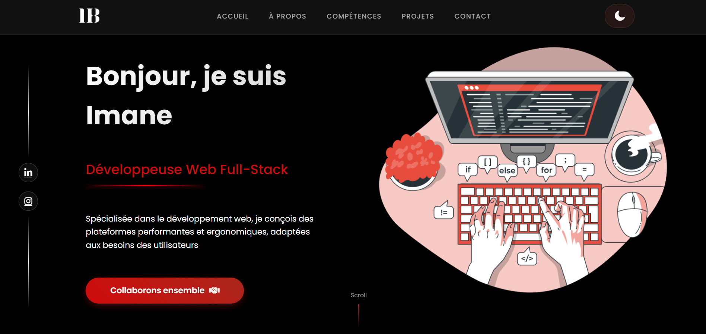
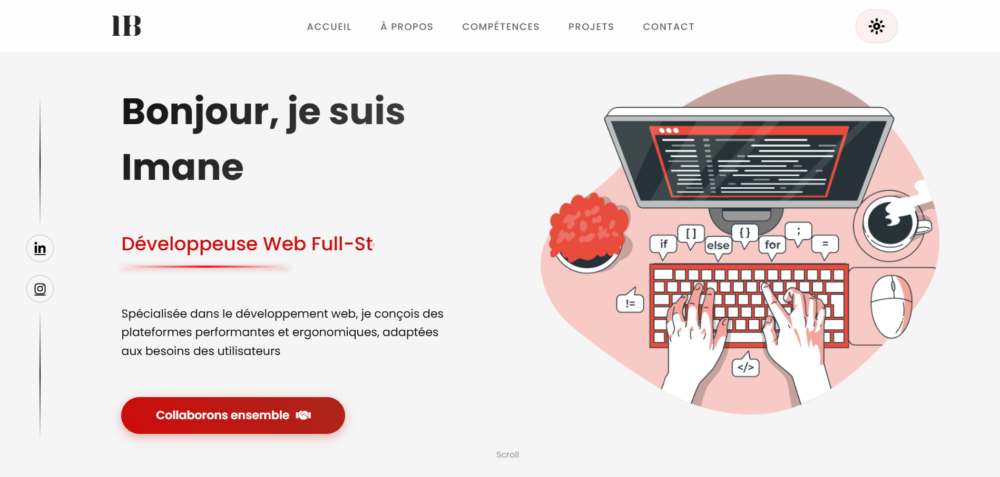
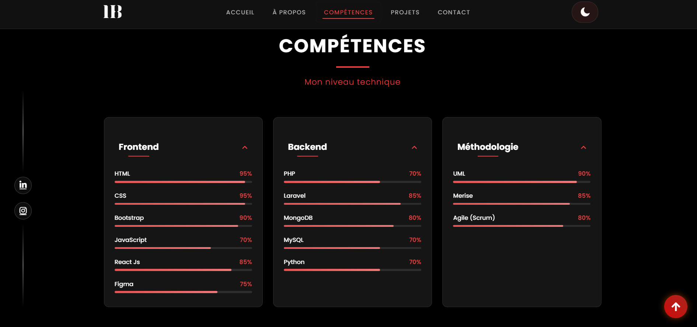
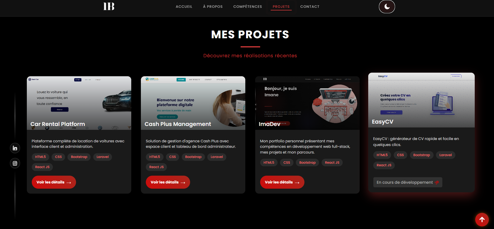

# 💼 Mon Portfolio — Imanedev-1

Bienvenue sur mon **portfolio personnel**, un espace où je présente mes projets, mes compétences, et ma passion pour le développement web moderne 💻  

🔗 **Site en ligne :** [https://imaneb-dev.netlify.app](https://imaneb-dev.netlify.app)

---

## 🌟 À propos
Ce portfolio a été conçu pour mettre en valeur mon parcours et mes réalisations .  
Il reflète mon style, mon sens du design et mon envie de créer des interfaces claires, modernes et responsives.

---

## 🛠️ Technologies utilisées
- ⚛️ **React.js** – pour la structure et la logique du site  
- 🎨 **CSS classique** – pour le style et le responsive design  
- 💡 **HTML5** – pour la base des pages  
- 🌐 **Netlify** – pour l’hébergement rapide et fiable  

---

## 🚀 Fonctionnalités principales
- Mode clair / sombre ☀️🌙  
- Design responsive (ordinateur, tablette, mobile)  
- Section compétences, projets,about et contact 📬  
- Animation fluide et transitions élégantes ✨

## 📸 Aperçu du portfolio

